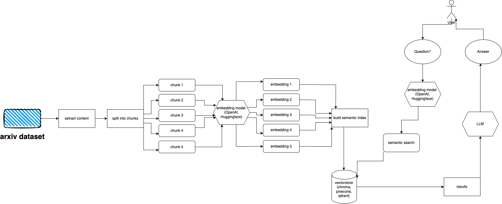
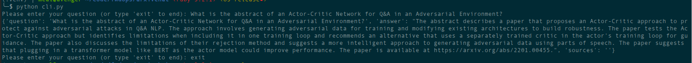

# arxivchat

Welcome to arXivchat!

arXivchat is LLM based software that let's you talk about arXiv published papers in a conversational way.
It works as a cli tool, API provider and ChatGPT plugin.

Made by [Forward Operators](https://fwdoperators.com). We work with some of the smartest people on LLM and ML-related projects.

You are more than welcome to contribute!

## Dependencies
- python >=3.10
- poetry
- chromadb
- langchain
- arxiv

## Architecture




## Setup
Follow these steps to quickly set up and run the arXiv plugin:

- Install Python 3.10, if not already installed.

- Clone the repository: git clone https://github.com/Forward-Operators/arxivchat.git

- Navigate to the cloned repository directory: cd /path/to/arxivchat

- Install poetry: `pip install poetry`

- Create a new virtual environment with Python 3.10: `poetry env use python3.10`

- Activate the virtual environment: `poetry shell`

- Install app dependencies: `poetry install`


Set the required environment variables:

```bash
export DATABASE=<your_datastore>
export OPENAI_API_KEY=<your_openai_api_key>

# Add the environment variables for your chosen vector DB.

# Pinecone
export PINECONE_API_KEY=<your_pinecone_api_key>
export PINECONE_ENVIRONMENT=<your_pinecone_environment>
export PINECONE_INDEX=<your_pinecone_index>


# Qdrant
export QDRANT_URL=<your_qdrant_url>
export QDRANT_PORT=<your_qdrant_port>
export QDRANT_GRPC_PORT=<your_qdrant_grpc_port>
export QDRANT_API_KEY=<your_qdrant_api_key>
export QDRANT_COLLECTION=<your_qdrant_collection>

# Chroma
export CHROMA_HOST=<your_chroma_host>
export CHROMA_PORT=<your_chroma_port>
export CHROMA_COLLECTION=<your_chroma_collection>

# Embeddings
export EMBEDDINGS=<openai or huggingface>
export CUDA_ENABLED=<True or False> - needed for huggingface

```

Run the API locally: `cd app/; gunicorn --worker-class uvicorn.workers.UvicornWorker --config ./gunicorn_conf.py main:app`

Access the API documentation at http://0.0.0.0:8000/docs and test the API endpoints .

## Ingesting
arXiv has a dataset of almost 2 million publications. it is against arXiv's ToS to fetch too much data from their website (as it creates load)
Fortunately, good people from [kaggle](https://kaggle.com) together with Cornell University create a publicly available dataset that you can use.
The dataset is freely available via Google Cloud Storage buckets and updated weekly.

Now the main issues is - how to get only a subset of that entire dataset if we don't want to ingest over 5 terabytes of pdf files?
Dataset is divided into directories per-month, per-year, so if you'd like to get all publications from September of 2021, you could just run:
`gsutil cp -r gs://arxiv-dataset/arxiv/pdf/2109/ ./local_directory`

If you'd like to get an entire dataset:
`gsutil cp -r gs://arxiv-dataset/arxiv/pdf/  ./a_local_directory/`

But if you want to get only a subset (for a given category and dates) take a look into `download.py` file.

By default ingester is expecting this files to be at `/mnt/dataset/arxiv/pdf` with all pdf files there.

Check out and run `python scripy.py` to ingest data. You can also enable debugging there if something doesn't work.

_TODO: maybe change this to directory loader_
_TODO: implement celery deployment and use worker for ingestion_


## Query
`python cli.py`



Ask the question about the topic you've fed the database before. Returns information about sources as well, runs continously.
Another option is to use REST API (run `uvicorn main:app --reload --host 0.0.0.0 --port 8000` from the `app` directory) or use it as ChatGPT plugin (after deployment)

## Deployment
There are terraform files in `deployment` directory. Use one that suits you best. There's README file in each of them with instructions.
You can also just build a Docker image and run it wherever you want. The image file is quite big though. 

### GCP
For now can be deployed as Cloud Run using docker image, so it's API only deployment. Data ingestion must be run on other machine (I do recommend GPU-enabled Compute Engines, especially if you'd like to use Hugging Face embeddings and because you can mount datase from Google Storage directly using `gcsfuse`)
Potential [solution](https://cloud.google.com/run/docs/tutorials/network-filesystems-fuse) to use GCS bucket with Cloud Run
### Azure
For now it can be deployed as Container Apps (API only deployment, you need another deployment for ingester)

### AWS
AWS is not supported yet. Coming soon.

## Embeddings

### OpenAI
arxivchat uses `text-embedding-ada-002`  for OpenAI by default, you can change that in `app/tools/factory.py`

### HuggingFace
For now you can use any model that works with [`sentence_transformers`](https://huggingface.co/sentence-transformers).
You can change the model in `app/tools/factory.py`


## ToDO
- [ ] Automount gcs arxiv bucket on deployment.
- [ ] Option to use Azure OpenAI.
- [ ] AWS deployment
- [ ] Add tests
- [ ] Automate ingesting new publications
- [ ] Add more vectostores options
- [ ] Add more embeddings options
- [ ] Support streaming responses
- [ ] Take embeddings model name from .env

## Issues & contribution
If you have any problems please use GitHub issues to report them.

## Contributing
We'd love your help in making arXivchat even better! To contribute, please follow these steps:

- Fork the repo
- Create a new branch
- Commit your changes
- Push the branch to your fork
- Create a new Pull Request

## License
arXivchat is released under the MIT License.